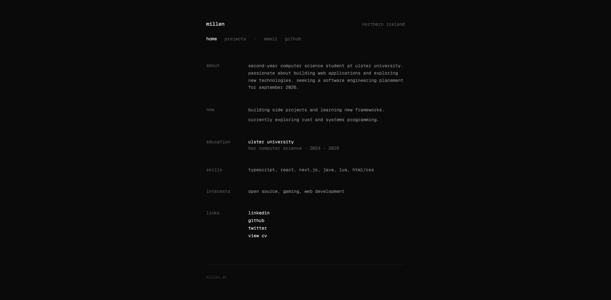

# millen.sh



minimal portfolio built with next.js 16

## stack

- next.js 16
- react 19
- typescript
- tailwind css

## features

- minimal two-column layout
- fade-in animations
- mobile responsive
- monospace typography

## run locally

```bash
git clone https://github.com/milnee/Portfolio.git
cd Portfolio
bun install
bun run dev
```

## contact

millensh@outlook.com

